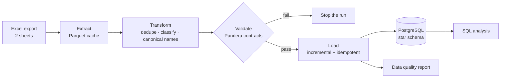

# Retail ETL & Data Quality Pipeline

> **Portfolio case study.** Simulated client: a UK online gift retailer whose sales exports are messy and whose reports don't add up.
> Data: [UCI Online Retail II](https://archive.ics.uci.edu/dataset/502/online+retail+ii) (CC BY 4.0) · 1,067,371 invoice lines · Dec 2009 – Dec 2011.


## The problem

The retailer's analysts build reports straight from the Excel export. Revenue numbers never match finance's numbers. This project builds a pipeline that turns the raw export into a **validated, analysis-ready PostgreSQL star schema** and documents every row it removes and why.

## What the pipeline found

| Issue in the raw data | Rows | Handling |
|---|--:|---|
| **The two Excel sheets overlap (1–9 Dec 2010)** | 22,523 | Keep the later sheet. A naive concat **double-counts £377,488** of revenue |
| Exact duplicate lines | 11,812 | Removed |
| Cancellations (invoice `C…`) | 19,103 | Kept as `return` lines, not as sales |
| Postage, marketplace fees, bank charges, tests | 4,641 | Kept as `fee`, excluded from product sales |
| Stock and bad-debt adjustments (incl. prices down to −£53,594) | 3,411 | Kept as `adjustment` |
| Lines with unit price 0 | 2,588 | Kept as `zero_price` |
| Lines without a customer ID | 22.8% | Counted in revenue, excluded from customer metrics |
| Products with several names over time | 1,232 codes | One canonical name per product (most frequent) |

Full numbers: [`docs/data_quality_profile.md`](docs/data_quality_profile.md) (raw profile) and [`docs/data_quality_report.md`](docs/data_quality_report.md) (written by every pipeline run).

## Architecture



**Star schema** (`sql/schema.sql`): `fact_sales_line` (1 row per invoice line, with a `line_type`) plus `dim_date`, `dim_product`, `dim_customer` and `dim_country`. An `etl_runs` table audits every load.

**Incremental & idempotent load.** Each line gets a stable MD5 fingerprint (`line_hash`, unique in the database). A run only stages lines newer than the latest loaded timestamp, and inserts use `ON CONFLICT DO NOTHING`:

| Run | Command | Rows inserted | Fact table |
|---|---|--:|--:|
| 1 | `--until 2010-12-31` (first year only) | 538,375 | 538,375 |
| 2 | full run (only new lines) | 494,661 | 1,033,036 |
| 3 | full run again | **0** | 1,033,036 |

**Data contracts** (`src/etl/validate.py`): Pandera rules on 11 columns plus 3 cross-column checks. Examples: invoice format, unique `line_hash`, sales with positive quantity and price, `revenue = qty × price`. The contracts caught a real anomaly during development: a cancellation invoice with a *positive* quantity, now classified as an adjustment.

## Business insights (SQL)

Queries live in [`sql/analysis/`](sql/analysis/). Highlights:

- **Seasonality:** November is the peak month in both years (£1.39M net in 2010, £1.43M in 2011).
- **Revenue is concentrated:** the top 10% of identified customers generate **63%** of revenue (`03_customer_concentration.sql`).
- **Retention:** 35–61% of new customers re-order within 90 days, depending on the cohort (`04_repeat_customers.sql`).
- **A product to investigate:** *Rotating Silver Angels T-Light Holder* is a top-10 product with a **30% return rate**, vs. 0.4–5.5% for the rest of the top 15 (`02_top_products_and_returns.sql`).
- **Returns by market:** Spain returns 13.3% of sales value, vs. 3.8% for the UK (`05_returns_by_country.sql`).
- `06_quality_checks.sql`: post-load assertions. All return 0 failures.

## Tech stack

Python 3.12 · Pandas · Pandera · PostgreSQL 16 · Docker Compose · psycopg 3 · SQL (CTEs, window functions) · pytest · GitHub Actions

## How to run

```bash
# 1. Database
cp .env.example .env              # set a password (and POSTGRES_PORT if 5432 is taken)
docker compose up -d

# 2. Python environment
python3.12 -m venv .venv && source .venv/bin/activate
pip install -r requirements.txt

# 3. Pipeline
python -m src.etl.download        # ~45 MB from UCI
python -m src.etl.profile         # raw data quality profile
python -m src.etl.pipeline        # extract → transform → validate → load → report

# 4. Tests
pytest
```

The integration test (`tests/test_load_integration.py`) drops and recreates the tables, so it only runs when `TEST_DATABASE_URL` points to a throwaway database. GitHub Actions provides one on every push.

## Project structure

```
├── src/etl/
│   ├── download.py      # dataset download
│   ├── extract.py       # Excel → Parquet cache
│   ├── profile.py       # raw data quality profile
│   ├── transform.py     # cleaning rules + line classification
│   ├── validate.py      # Pandera data contracts
│   ├── load.py          # incremental, idempotent Postgres load
│   ├── report.py        # data quality report
│   └── pipeline.py      # CLI entry point
├── sql/
│   ├── schema.sql       # star schema
│   └── analysis/        # business queries + post-load checks
├── tests/               # unit tests + Postgres integration test
├── docs/                # data quality profile and report
└── docker-compose.yml
```

## Limitations

- The source is a static historical export. The incremental logic is demonstrated by splitting it into batches with `--until`.
- `dim_customer` keeps the country of the customer's latest purchase (SCD type 1), not the full history.
- Guest checkouts (no customer ID) can't be tracked across orders.

## Author

**Fernando Flores**: Data Analyst · Backend · AI Automation · [GitHub](https://github.com/ferflorwers25) · [LinkedIn](https://linkedin.com/in/fffa)
